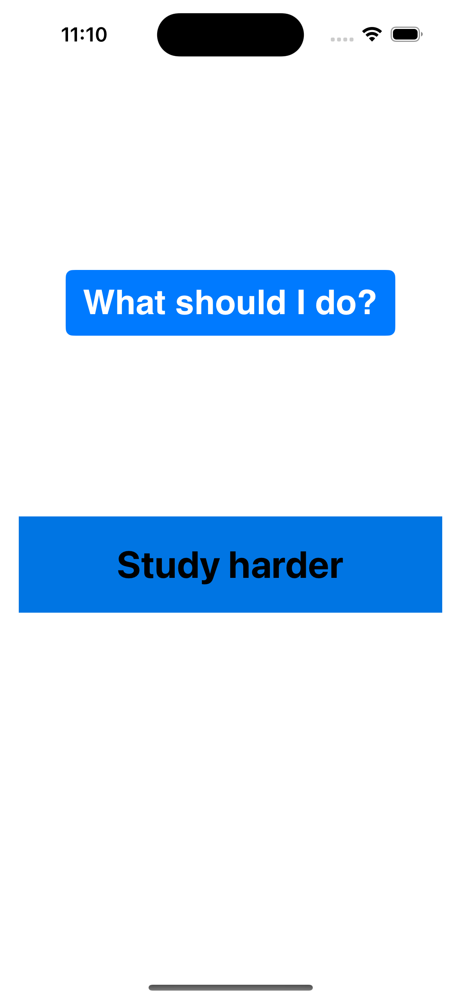

# iDecide 8Ball

iDecide 8Ball is a straightforward and simple iOS application developed in Objective-C, inspired by the classic magic 8-ball toy. It offers a fun and minimalist way for users to receive randomized responses to their "What should I do?" question.

    
    
    

## Features

- **Ask a Question**: Users can tap a button to receive an answer to the question "What should I do?".
- **Random Responses**: The app offers a variety of responses, providing a random response with each tap.
- **Cycle Detection**: Once all responses have been shown, the app prompts the user to ask again, ensuring fresh interactions.

## How It Works

Upon launching the app, users are prompted to ponder "What should I do?" After tapping the button, the app provides a random piece of advice or suggestion from a predefined array of options.

## Technologies Used

- **Objective-C**: The programming language utilized for app development.
- **UIKit**: Used for crafting the user interface, employing storyboards for layout design.
- **Xcode**: The development environment for building and testing the iOS application.

## Getting Started

To run this project locally, you'll need:

- Xcode installed on your Mac.
- Clone this repository to your local machine.
- Open the project in Xcode.
- Compile and run the project on a simulator or your iOS device.
